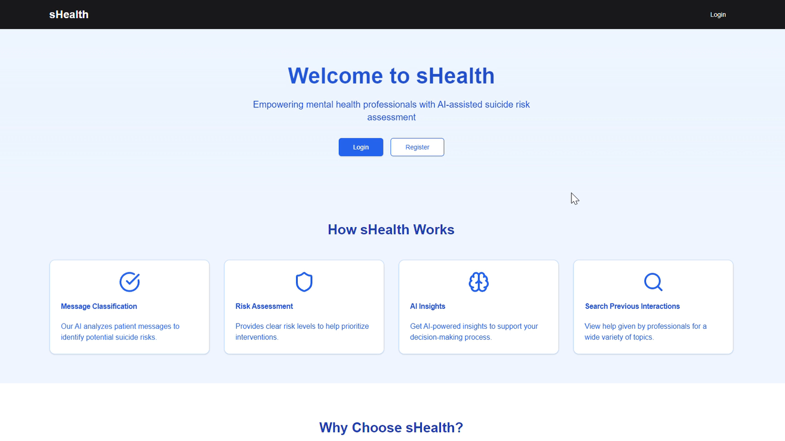

# sHealth Frontend

## Overview

Welcome to the sHealth Frontend project! This project is designed to provide an intuitive interface for mental health professionals to interact with the sHealth system. It features a dashboard for message input, AI-powered classification, and chat functionalities to assist in suicide risk assessment.

## Directory

- [Features](#features)
- [Installation & Running](#installation--running)
- [Technologies Used](#technologies-used)
- [Contributing](#contributing)
- [License](#license)

## Features

- **User-Friendly Dashboard**: Allows easy input of patient messages and displays AI-generated classifications.
- **AI Chat**: Facilitates conversations with an AI to discuss suicide prevention and risk assessment.
- **Classification History**: Keeps track of previously classified messages for review.
- **Responsive Design**: Ensures a seamless experience across different devices.

Watch the demo below:
[](https://drive.google.com/file/d/1NBvcfwC6Wu7oHaS7yORaTk3bm55qb1s3/view?usp=sharing)


## Installation & Running

```bash
npm run dev
# or
yarn dev
# or
pnpm dev
# or
bun dev
```

Open [http://localhost:3000](http://localhost:3000) with your browser to see the result.

## Technologies Used

- **TypeScript**
- **React**
- **Next.js**
- **Tailwind CSS**
- **Framer Motion**
- **Lucide Icons**

## Contributing

We welcome contributions! Please read our [contributing guidelines](CONTRIBUTING.md) for more details.

## License

This project is licensed under the MIT License. See the [LICENSE](LICENSE) file for more information.
